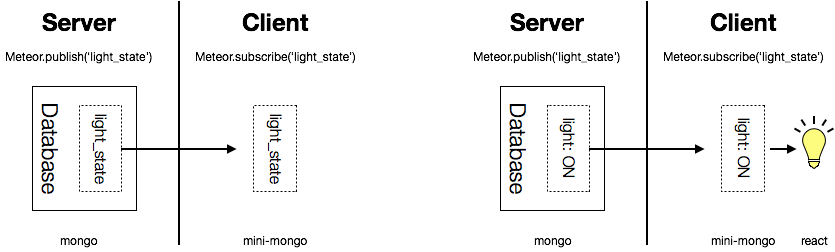

# Day 01 [從 MeteorJS 學習網路應用開發] 什麼是 Meteor？為什麼用它？

來談談 Meteor 吧！

首先是[官網](https://guide.meteor.com)的介紹：
> Meteor is a full-stack JavaScript platform for developing modern web and mobile applications. Meteor includes a key set of technologies for building connected-client reactive applications, a build tool, and a curated set of packages from the Node.js and general JavaScript community.

就如同上面提到的，Meteor 是一個全端(Full-stack)的 web 應用框架，標榜著可以用單一的程式語言，也就是 Javascript 來開發，他是一個前端框架＋socket＋node.js＋mongodb 的組合，特別對於需要即時互動的應用，可以很快的建立出雛形。

其實 Meteor 早在 2012 年就推出，它包含自己的前端框架(Blaze templating engine)、建制工具(build tool)和套件管理系統，也有自己的套件平台([atmosphere](https://atmospherejs.com))和伺服器管理服務([Galaxy](https://www.meteor.com/pricing))，甚至是通訊協定(DDP)。

儘管一開始因為資料傳輸的方式備受讚揚，但高度整合型的框架卻讓客製化上變得困難，尤其 2013 出現的 React、2015 年出現的 Redux，都取代 Meteor 某方面的特色。所幸在之後的版本(1.2)後開始支援其他的前端框架，也回到 npm 的套件管理，因此現在在開發上可以取得 React, node 的豐富資源並保留 Meteor 資料傳輸的特色。

Meteor 前端在資料的獲取上是藉著 Reactive Programming 的方式，也就是前端向後端「訂閱(subscribe)」特定的資料後，後端會持續「發布(Publish)」資料給前端，前端再根據這些資料改變呈現的方式，如下圖。

如果熟悉 Redux 的話，可以想像在運作上就好比將 Redux 的部分 store (儲存元件狀態的地方)直接和後端同步，因此可以很簡單的處理多人的協作。而在資料的寫入方面，Meteor 提供 client 端的 minimongo 與後端的 mongo 作對應，並且當作 cache，因此當前端寫入資料時，可以利用 cache 快速反應結果，如果有衝突再由後端修正，藉此減少反應的時間。

簡介暫時就到這裡，Meteor 因為 socket 和同步的特性，並不適合用在大型高流量的網站，會有效能上面的問題，但每個框架都有適合的應用，對於小型多人的即時互動上，Meteor 就有很大的好處，另外只用單一語言的特性，也讓整體學習的成本降低，自己認為很適合當作個人專案或是學習使用。

[返回目錄](../README.md)
