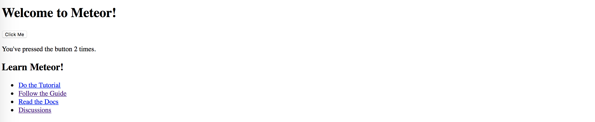

# Day 02 [從 MeteorJS 學習網路應用開發] Hello Meteor

在上一篇提到 Meteor 的簡介，這篇會開始講 Meteor 的安裝以及資料夾的結構。

這裡就很普通的按照官網上的[安裝教學](https://www.meteor.com/install)，Windows 系統需要多花點功夫，如果是 OSX 或是 linux 系統只要輸入：
```bash
curl https://install.meteor.com/ | sh
```

安裝完後可以按照以下的步驟執行
```bash
# 1. 利用 meteor create 建立 project
meteor create project_name && cd project_name

# 2.1 安裝 node modules：這邊必須要用 meteor 內建的 npm 安裝，
# 如果直接用 npm 安裝部分套件會有問題，未來安裝其他 node module 也是一樣
# 這部份可以參考官網的說明(https://docs.meteor.com/commandline.html#meteornpm)
meteor npm install

# 2.2 如果偏好 yarn 的話也可以用 yarn 安裝
meteor npm install -g yarn
meteor yarn install

# 3. 執行，或是用 meteor npm start 或 meteor yarn start
meteor run
```

最後瀏覽器連上 `http://localhost:3000` 就可以看到簡單的計數器程式


在這個基本的程式中，前端部分是用 Meteor 自己的 Blaze Template，在接下來的文章中，會改由使用 React，不過在這裡，還是先利用目前的程式說明專案的資料夾結構，現在的結構可以擴充如下：
```bash
.meteor/
  packages              # 用到的 Meteor package，
  platforms             # 支援的平台，這邊只有 client, server
  release               # Meteor 的版本
client/                 # [automatically loaded in client side]
  main.js               # (client) client 端的起點，從這裡由 import/ 載入需要的檔案

server/                 # [automatically loaded in server side]
  main.js               # (server) server 端的起點，從這裡由 import/ 載入需要的檔

imports/                # [mutually loaded by client or server]
  api/                  # (both) database collections and api
  startup/
    client/             # (client) client startup configuration
    server/             # (server) server startup configuration
  ui/                   # (client) Front-end (React or etc)

private/                # (server) Asset only for server

public/                 # Public asset, such as favicon.ico

package.json
...                     # [automatically loaded by both server and client side]
```

如上圖，Meteor 在載入檔案的時候，會根據檔案被放置的位置決定該載入到 server 或是 client，詳細的規則可以參考[官網的介紹](https://guide.meteor.com/structure.html)，不過只要根據以下的原則就沒有問題：
1. 所有未來的程式碼都應該放在 `imports/` 資料夾下，並利用指定路徑 `import` 的方式載入(lazy loading)
2. 盡可能的保持 `client/`、`server/` 底下的檔案不做更動，`client/main.js` 和 `server/main.js` 等只是載入的起點，應該藉著他們載入 `imports/` 底下的檔案
3. 在任何位置只要是資料夾名稱 `client` 底下都不會被 server 載入，資料夾名稱 `server` 底下都不會被 client 載入
4. 也可以用程式碼來控制
```javascript
// This file is imported by both client and server,
// for example the definition of collections and meteor method

console.log('Execute in both');

if (Meteor.isServer) {
  console.log('Execute in server');
}

if (Metoer.isClient) {
  console.log('Execute in client');
}
```

根據目前自己的使用經驗，`api` 底下的資料夾還需要根據功能劃分，才比較容易區別哪些檔案該在哪個地方被載入，也比較清楚，不過這部份就留給之後吧（這樣才有東西寫），在下一篇文章，會將 React 引入，並同時設定 eslint 來協助未來的開發。

[返回目錄](../README.md)
