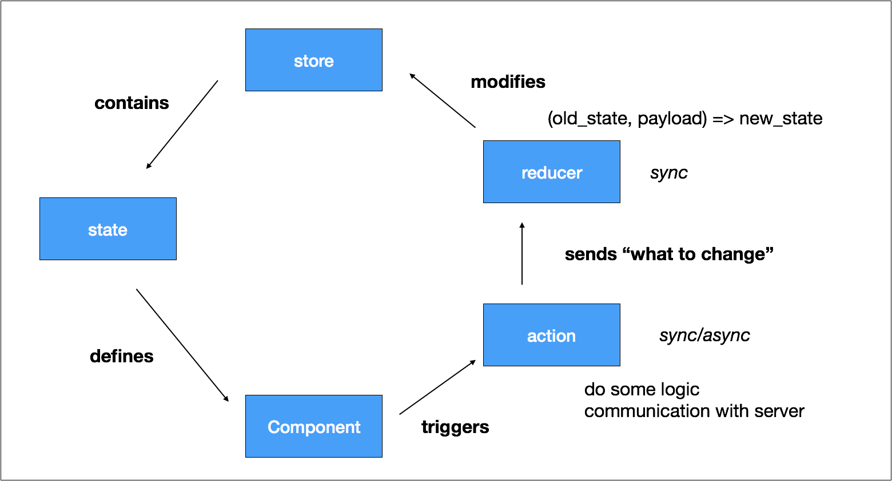

# Day 04 [從 MeteorJS 學習網路應用開發] 在 Meteor 中使用 Redux

Redux 目前幾乎是前端處理資料流的標準配備，尤其當前端是 React 的時候，今天的部分會很簡略的先複習 Redux，並說明它的特色，接著說明 Redux 配合 websocket 在使用上的問題，最後說明在 Meteor framework 中 Redux 佔據的地位，今天的部分會有許多主觀的看法，不盡然是正確的，對於有問題的部分，也期待可以和網友討論。

在 Redux 的官網上有以下的說明：
> Redux is a predictable state container for JavaScript apps.

也就是說 Redux 提供一個全域的狀態(稱為 store)，修改這個狀態一定要藉著 dispatch action，再經過 reduce 修改，而最後 UI 根據目前的狀態處理呈現的方式。因為每個行為造成的狀態改變都是可以預期的，而且資料的流動都是單一的方向，對於開發上除錯有相當大的幫助。

Redux data flow 修改自[thinking in redux](https://imgur.com/DskMIRx)



Redux 另外也提供可以自訂的 middleware，當作 action 到 reducer 之間的 pipline，這樣一來，所有的 action 都會先經過這些 middleware 處理，最後才進到 reducer，這在紀錄 log 的時候非常好用。網路上的社群也提供許多好用的 middleware，例如 [thunk](https://github.com/gaearon/redux-thunk) 可以處理非同步的 action 或是由一個 action 觸發其他的 action 等等。

這裡可以發現所有和 server 端資料的溝通處理都會在 action 的階段，這在使用 AJAX 的情形下比較沒有問題，但是如果是用 websocket 或是推播服務，就會比較麻煩。尤其是像是共用白板這樣的應用，有很多的時候 client 會被動的接收資料，這時可能有兩種作法
1. 第一個作法可以用一個特殊的 component 來接收這些資料，再發送 action，缺點會造成接收資料的部分分散
```javascript
// 程式碼只是示意
class SocketHandler {
  componentDidMount() {
    this._socket = new Socket();
    this._socket.on('some_event', () => {
      // dispatch some redux action
    })
  }
}
```

2. 第二種作法是將 socket listener 放在 middleware，由 server 來發出 action 或是 thunk，[例如](https://github.com/itaylor/redux-socket.io)，但缺點就是 server 端不再只是傳送資料，連 action 也必須知道。

Meteor 在處理這些需要實時同步的資料提供 Subscribe & Publish 的方式，可以想成直接協助開發者把需要同步的部分丟在特別的 store，這邊的同步由 Meteor 負責，所以前端要做的就只是由這個 store 的狀態定義呈現的方式（聽起來有點像第一種作法的打包@#$%）。因此就我目前的想法，在 Meteor 中 redux 可以負責與 server 無關的狀態處理（例如清單 filter 的呈現，更換應用的佈景主題）和不需要同步的資料獲取，把需要同步的部分交給 Meteor 處理。

今天的部分用範例說明用 Redux 改變 [Material-ui](https://material-ui-next.com) 的佈景主題，有興趣可以參考[這裡](https://github.com/pomelyu/meteor-message/releases/new?tag=user-redux-change-theme)

[返回目錄](../README.md)
