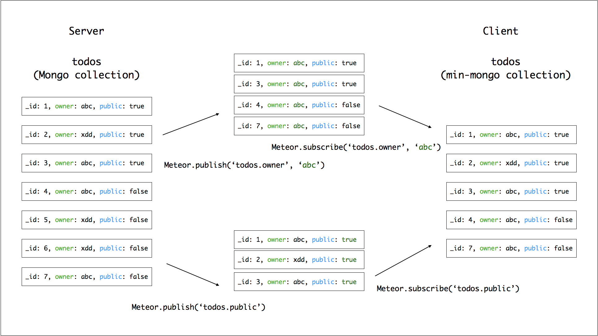
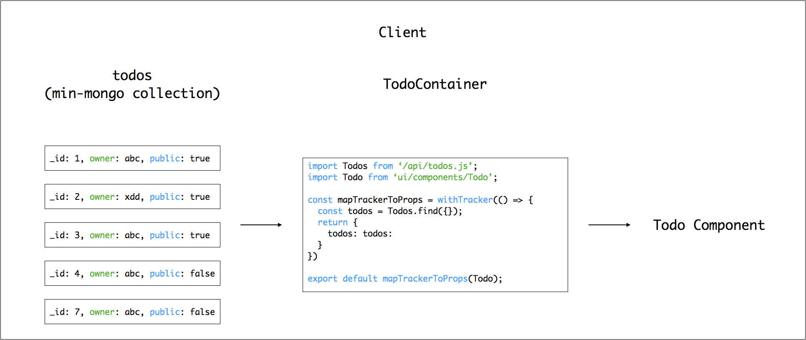
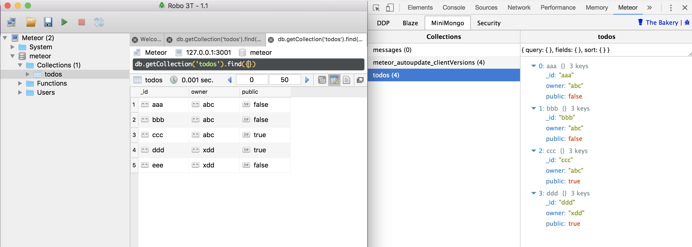

# Day 05 [從 MeteorJS 學習網路應用開發] Publish & Subscribe

上一篇文章提到 Redux 在 Meteor 中的使用，今天會將重點放在 Meteor Publish & Subscribe 的資料傳遞方式，下圖可以說明整個流程：

Meteor Publish & Subscribe



名詞說明：
1. mongoDB：最常被使用的 NoSQL，Meteor 預設使用的資料庫
2. minimongo：meteor 在前端對應後端 mongoDB 的小型資料庫，也包含一些存取資料的 api
3. collection：mongo db 中描述一種資料的集合，例如 todos 這個 collection 就包含所有的 todo 資料
4. document：mongo db 中用來描述一筆資料，例如一個 todo 的確切內容，屬於誰的？是否公開？創建的時間？
5. publication：可以想像就是一個資料流，例如圖中的 `todos.owner`、`todos.public` 都是

如上圖，當程式執行時，server 端利用 meteor 的 mongo library 當作存取介面，根據每個 publication 的要求，將符合條件的資料整理出來，例如在上圖中 `todos.public` 就是 publish 所有公開的資料(`public: true`)。有可能前端訂閱的幾個 publication 剛好都在同一個 mongoDB 的 collection，這時 meteor 會把這些資料合併，前端需要使用 query 語法取得需要的資料。

上面只是很籠統的描述，以下是詳細的說明：

1. 定義需要的 mongo collection，並讓 client, server 載入，這邊是定義 `todos`
```javascript
// imports/api/todos/todos.js
import { Mongo } from 'meteor/mongo';

// 命名規範是 collection 名稱為小寫開頭的複數形，對應的 instance 為大寫的複數形
const Todos = new Mongo.Collection('todos', /* options */);
export default Todos;


// server/main.js

// 這會讓 server 建立 todos 這個 collection，
// 只要有資料加入，就會把資料寫入 mongoDB 的 todos collection 中
import 'imports/api/todos/todos.js';


// client/main.jsx

// 這會讓 client 在 browser 上建立 minimongo todos collection，
// 可以想成 mongoDB todos collection 的分身
import 'imports/api/todos/todos.js';

```

2. 定義 `todos.owner` 和 `todos.public` 兩個 publication，並由 server 載入
```javascript
// imports/api/todos/todo_publications.js
import { Meteor } from 'meteor/meteor'
import Todos from './todos.js';

Meteor.publish('todos.owner', (userId) => {
  // 這和 mongo db 的語法非常相近，也就是找出所有 owner 是 userId 的文件
  // publication 回傳值必須要是 mongoDB 的 cursor，或是 cursor 的 array
  return Todos.find({ owner: userId });
})

Meteor.publish('todos.public', () => {
  // 類似上面的，這邊是找出所有公開的文件
  return Todos.find({ public: true });
})

// server/main.js

// publish 只能從 server 執行，所以只要從 server 載入就好
import 'imports/api/todos/todos.js';
import 'imports/api/todos/todo_publications.js';

```

3. 安裝 `react-meteor-data` packages
```bash
meteor add react-meteor-data
```

4. 從前端訂閱(subscribe)並獲取資料到 Container

```javascript
// imports/ui/containers/TodoContainer.js

import { withTracker } from 'meteor/react-meteor-data';
import { connect } from 'react-redux';

import Todos from 'imports/api/todos/todos.js';
import Todo from 'imports/ui/component/todo';

Meteor.subscribe('todos.owner', userId);
Meteor.subscribe('todos.public');

const mapTrackerToProps = withTracker(() => {
  const userId = Meteor.userId() // 登入的帳號;
  
  // 這邊必須要用 find(...).fetch() 來取得真正的資料
  const myTodos = Todos.find({ owner: userId }).fetch();
  const publicTodos = Todos.find({ public: true }).fetch();
  
  // 將資料轉成 component 的 props
  return {
    myTodos: myTodos,
    publicTodos: publicTodos,
  }
})

const mapStateToProps = state => ({
  // some state from redux store
});

export default connect(mapStateToProps)(mapTrackerToProps(Todo));
```

withTracker 是 meteor 特殊的函式，他會在函式內部的 database query 發生改變時，重新執行程式，因此當資料庫被新增一個公開的 todo，前端就會重新執行 `Todos.find({ public: true }).fetch()`，這樣就可以藉著 props 的傳遞更新 Todo compoent 呈現的資料。

因為目前的資料庫應該是沒有任何資料的，所以可以藉著加入假資料先來看看 publisher 和 subscribe 的結果。首先修改 `server/main.js` 如下
```javascript
import Todos from 'imports/api/todos/todos.js';

Meteor.startup(() => {
  Todos.upsert({ _id: 'aaa'}, { $set: { _id: 'aaa', owner: 'abc', public: false }});
  Todos.upsert({ _id: 'bbb'}, { $set: { _id: 'bbb', owner: 'abc', public: false }});
  Todos.upsert({ _id: 'ccc'}, { $set: { _id: 'ccc', owner: 'abc', public: true }});
  Todos.upsert({ _id: 'ddd'}, { $set: { _id: 'ddd', owner: 'xdd', public: true }});
  Todos.upsert({ _id: 'eee'}, { $set: { _id: 'eee', owner: 'xdd', public: false }});
});
```

這時可以在程式執行時，使用 [Robo 3T](https://robomongo.org) 連到 `localhost:3001` 查看 mongoDB 的情形，並使用 Chrome 的 [Meteor DevTools](https://chrome.google.com/webstore/detail/meteor-devtools/ippapidnnboiophakmmhkdlchoccbgje) 查看 minimongo 中的資料，如下：



今天可以說是在一片混亂中，簡單的介紹 publish & subscribe 這個資料由 server 傳遞到 client 的方式，在明天的部分，將反過來說明 meteor method 這個從 client 更改資料到 server 的方法

