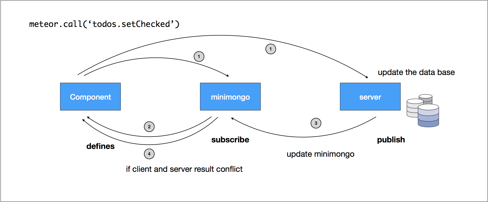
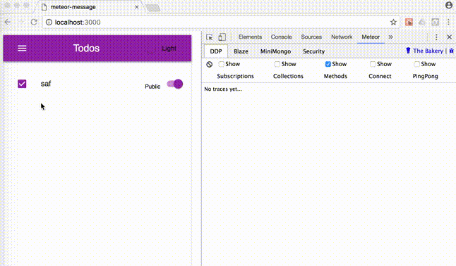

# Day 06 [從 MeteorJS 學習網路應用開發] 利用 method 修改資料

Meteor 提供 pubish & subscribe 的方式，讓 client 可以獲得 server 的資料，在另一個方向提供 meteor method 的方式寫入資料到 server，可以視為寫入的 api。

一般利用 http request 的方式和 server 溝通，必須等到 server 收到請求、處理、回覆後，前端才能根據回覆的結果呈現資訊。meteor 在這個部分以 minimongo 當作快取，如下圖



在前一個部分提到 minimongo 相當於後端資料庫在前端的分身，因此當前端發出一個動作(todo.setChecked)，這個動作會同時作用在前端的 minimongo (Todos)和後端的 mongo (Todos)，由於 UI 元件是根據 minimongo 的狀態呈現，因此即使後端 server 因為通訊問題有延遲，前端也可以馬上呈現結果。當然這個結果很有可能是錯的，例如在協作環境下，其他的使用者可能也同時動到相同的資料，這時最後的呈現結果就會以後端認定的結果為準。

利用 minimongo 作為 cache 的好處讓 meteor 可以即時反應前端資料寫入的結果，有錯誤再修正，由於常見的互動應用對於即時性的要求很高，因此對於錯誤有一定的容忍度，但如果這樣的方式用在錯誤代價很高的情境，例如線上搶購商品，大概就會被吉了吧

接下來就來修改之前的 todo app，雖然官網的教學把資料庫對應的 method, publication, api 定義放在一起，但是我覺得這樣蠻混亂的，尤其 publication 只會在 server 端執行，還是拆開來分別載入比較恰當
```javascript
// imports/api/todos/todo_method.js
import { Meteor } from 'meteor/meteor';
import { check } from 'meteor/check';
import Todos from './todos.js';

Meteor.method({
  'todos.add': function(todo) {
    // 如果沒有先檢查 method 的 parameter，eslint 會發出警告
    check(todo, Object);
    Todos.insert(todo);
  },
  
  'todos.setChecked': function(todoId, checked) {
    check(todoId, String);
    check(checked, Boolean);
    // 和 mongo 的語法非常相近
    Todos.update({ _id: todoId }, { $set: { checked } });
  }
})

// server/main.js
import '/import/api/todos/todo_method.js';

// client/main.jsx
import '/import/api/todos/todo_method.js';
```

接著還有 container 的部分
```javascript
// imports/ui/containers/TodoPageContainer.js

import { Meteor } from 'meteor/meteor';
import { withTracker } from 'meteor/react-meteor-data';

import Todos from '../../api/todos/todos.js';

const mapTrackerToProps = withTracker(() => {
  const todos = Todos.find({}).fetch();
  return {
    todoList: todos,
    addTodo: (data) => Meteor.call('todos.add', data),
    handleTodoChecked: (id, checked) => Meteor.call('todos.setChecked', id, checked),
  }
})
```

接著可以來驗證，前後端執行不同指令時的情形
```javascript
// imports/api/todos/todo_method.js

Meteor.method({
  'todos.setChecked': function(todoId, checked) {
    // client 端，直接更新 checkbox 的資料
    if (Meteor.isClient) {
      Todos.update({ _id: todoId }, { $set: { checked } });
    }
    
    // server 端，延遲兩秒後，什麼都不作
    if (Meteor.isServer) {
      const delay2second = Meteor.wrapAsync((callback) => setTimeout(callback, 2000));
      delay2second();
    }
  }
})
```
上面執行的結果就會是，可以看到 checkbox 一開始因為 client 的 method 而取消勾選，但兩秒後，server updated 要求重新勾選



實際上 method 除了更新 server 端資料外，也可以用來向 server 要資料，不過會這樣用的原因是因為這筆資料不再 minimongo 當中，因此 client 會以 callback 的形式取得(async)，server 端是 sync function
```javascript
Meteor.method({
  'todos.getById': function(id) {
    return Todos.findOne({ _id: id });
  }
})

if (Meteor.isServer) {
 // server side is sync function
 const todo = Meteor.call('todos.getById', todoId);
 ... // do some thing with todo
}

if (Meteor.isClient) {
 // client side is async function
 Meteor.call('todos.getById', todoId, (err, result) => {
   ... // do some thing with result
 })
}
```

[返回目錄](../README.md)
