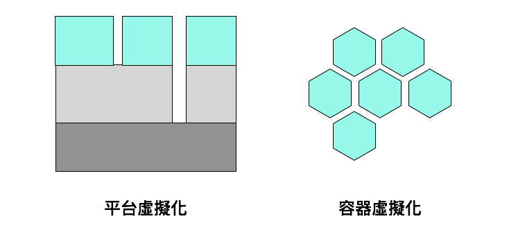
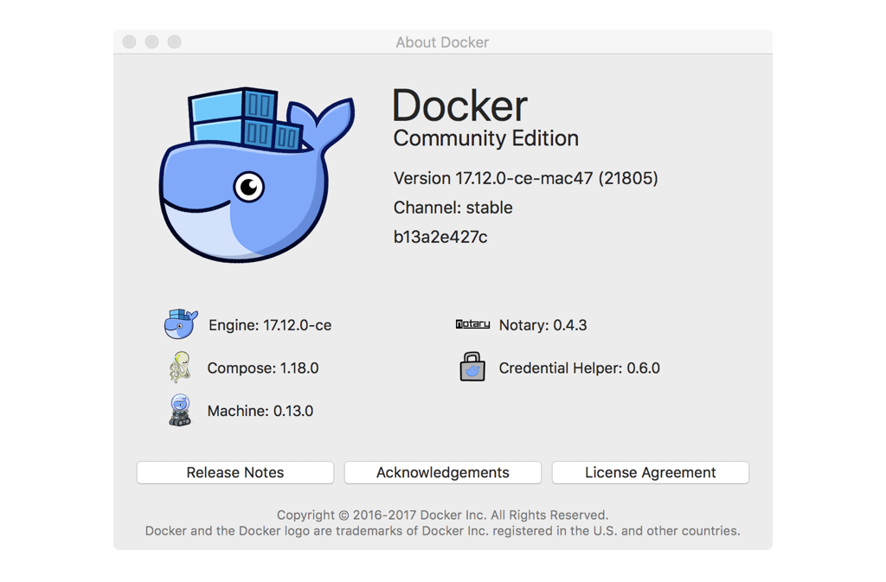
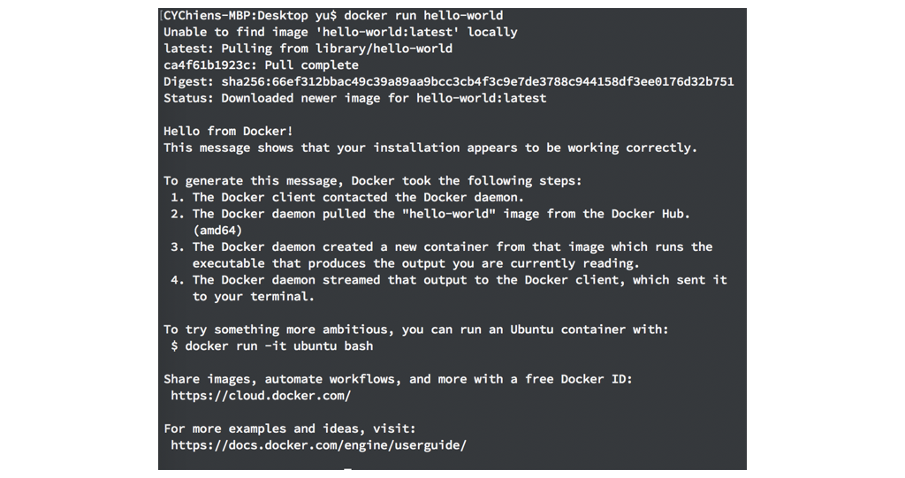
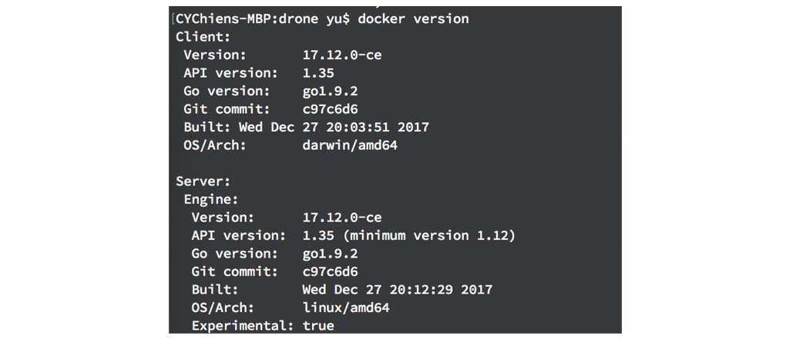
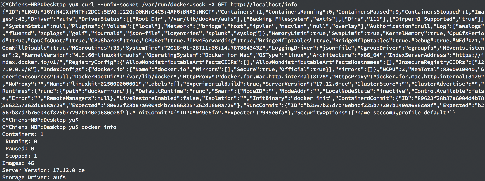

# Day 09 [從 MeteorJS 學習網路應用開發] Docker 簡介

這幾天的內容都是讀完 「[Docker 專業養成](https://www.tenlong.com.tw/products/9789864342648)」這本書後的筆記

## Docker 介紹
Docker 的圖示是一隻鯨魚上面承載許多的貨櫃，象徵著藉著虛擬技術可以將應用程式包裝成一個個的微服務(micro service)(貨櫃)，可以根據服務的增長或是減少隨意組合、擴充、替換成需要的樣子

環境設定一直以來都是程式開發或是運行中不可避免卻又令人煩躁的一塊，常常出現在電腦 A 運作一切正常，結果到電腦 B 卻跳出各種套件版本不合、權限錯誤、環境變數設定錯誤等等的問題。尤其現在的網路應用，需要多台伺服器組成叢集來應付大量的服務請求，伺服器也可能隨著應用的發展搬遷到不同的服務商（AWS, Heroku, Digital Ocean），如果每台伺服器都必須重新設定適合的運行環境，這樣會變得非常沒有效率也容易闕漏，更無法達到當前軟體開發中持續整合、持續部署、快速迭代的需求。

如果一開始就把應用程式運行在一台虛擬機器上，這個機器上已經做好所有的環境設定，當需要部署到其他伺服器時，就只要複製這台虛擬機器，讓他執行在其他伺服器就好，相關的環境設定在這台虛擬機器上設定一次即可，這樣不就很方便嗎？

Docker 的想法就類似如此，過去的虛擬機器是將整個作業系統當作一隻程式運行在宿主電腦上，中間透過 Hypervisor 讓虛擬的作業系統和宿主作業系統、資源溝通，儘管有非常好的隔離效果，但是對於效能卻有很大的影響，例如 VirtualBox 和各類型的 Android 虛擬機器。

Docker 運行的每一台「虛擬機器」稱為 Container，它藉著 Linux Kernel 本身的 Container 技術實現，Docker Container 中運行的每一個執行序都實際運行在宿主電腦上，不過藉著 Linux 的 Namespace 隔離軟體的資源、CGroup 隔離硬體資源來讓不同 Container 中的執行序和宿主電腦的執行序無法互相干擾，看起來每個 Container 就像是一台真正的「虛擬機器」，由於不需要透過 Hypervisor 的中介，整體的執行效能就強悍許多，一台個人電腦跑十個以上的 Container 都不成問題。

由於 Docker Container 相對虛擬機器輕量許多，因此在架構設計上會盡可能的讓一個 Container 只運行一個服務（應用），因此就有 Database 服務、DNS 服務、API server 服務等等，這樣的結果讓應用程式間去耦合，鬆散的結構讓整體的服務就好像用各個 Container 積木拼湊出來一樣，可以任意的抽換壞掉或是增加不足的服務。所以可以想像之前運行的 Meteor Todos 應用至少可以拆成 Meteor 應用和 Mongo 資料庫兩個服務。

下圖來自 「Docker 專業養成」這本書，解釋了平台虛擬化和容器虛擬化的不同

## 安裝 Docker
從以上的介紹可以發現 Docker 需要仰賴 Linux Kernel，因此只有在 Linux 上可以直接安裝，在 MacOS 或是 Windows 上需要分別安裝 [Docker for Mac](https://store.docker.com/editions/community/docker-ce-desktop-mac) 和 [Docker for Windows](https://store.docker.com/editions/community/docker-ce-desktop-windows)，使用虛擬的 Linux 來運行。

由於我的電腦是 MAC，所以就只要直接下載後安裝即可，Linux 系統可以參考官方的[安裝](https://docs.docker.com/install/linux/docker-ce/ubuntu/)，安裝後可以從工具列上的 About Docker 看到資訊，如下圖。另外跟 Linux 上運行的 Docker 不同，許多的設定必須要從 GUI 上設定，用 config 檔是不行的。

在上圖顯示除了 Docker 外，還安裝了其他的東西。Docker 底下兩個圖示本身就解釋了自己的功能，例如：章魚抓著幾個貨櫃的是 docker-compose，用來管理多個 container 運行的套件。被水缸關住的鯨魚是 docker machine，它是用來讓非 linux 系統可以執行 docker 的技術，在網路服務上非常重要。

接下來可以輸入 `docker run hello-world` 驗證安裝沒有問題，這行的執行結果會下載叫做 `hello-world:latest` 的映像檔並執行，執行的結果會說明運作的方式：

輸入 `docker version` 可以顯示 docker 的版本資訊

這邊可以發現輸出結果分成 docker sever 和 docker client 兩個部分，這是因為 docker 是 client-server 的架構，中間以 RESTful API （Docker API）連結，client 端稱為 Docker CLI 負責解析 command line 輸入的指令並顯示指令執行的結果，server 端稱為 Docker daemon，它是屬於系統的服務，負責實際執行 docker 的命令，因此所有的設定其實都是有關 Docker daemon 的設定。

Docker 選擇 client-server 架構是有原因的，因為 Docker 主要設計給網路服務的部署使用，拆開成 client-server，可以讓一個 client 端透過 Docker API 控制位於不同伺服器上的 docker daemon，方便進行伺服器叢集的管理，這也就是 Docker Swarm 在做的事情。可以想像 Docker Machine 的運作方式也是如此，Docker CLI 位在宿主的電腦(Mac, Windows)，而 daemon 位在 virtualbox 的虛擬 Linux 內。

在 linux 系統可以輸入 `dockerd --host ` 或是 `docker -h` 查看(dockerd 也就是 docker daemon ，Mac, Windows 沒有運行 daemon 所以不行)

所以用來查看 docker 資訊的指令也可以用呼叫 REST API 的方式執行，不過吐回的就是沒經過整理的 JSON，以下比較 `docker info` 和 `curl --unix-socket /var/run/docker.sock -X GET http://localhost/info` 的執行結果。

這個部分簡單的說到 docker 是什麼，下一個部分會著重在實際操作 docker，也就是利用 container 和 image 的部分。
