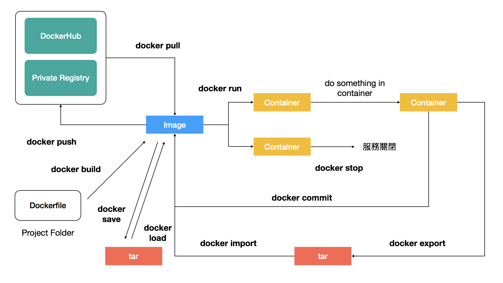
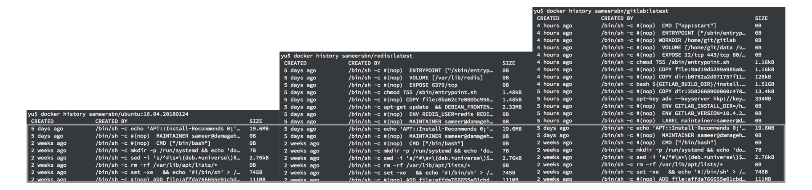
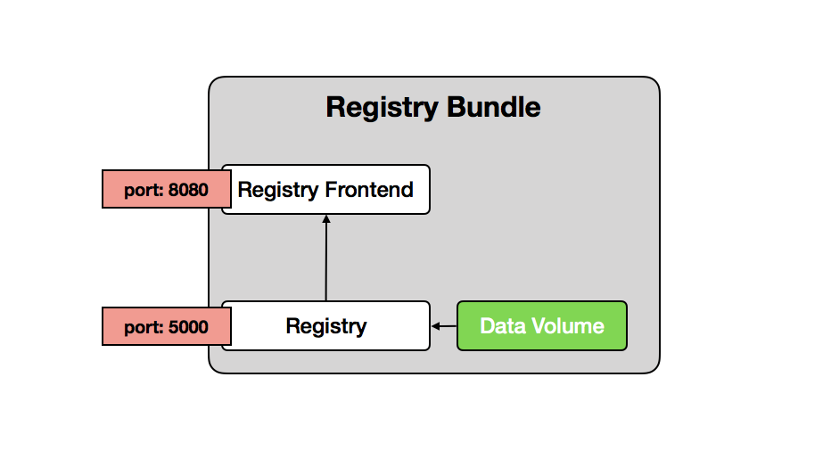
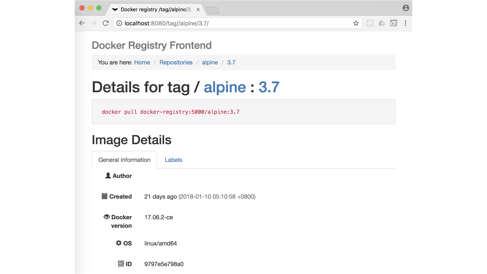

# Day 10 [從 MeteorJS 學習網路應用開發] Docker Container 簡介

## Docker Image（映像）與 Container（容器）

當我們在安裝虛擬電腦的時候，都需要指定安裝的作業系統，例如 Linux 的 Ubuntu, CentOS 或是謎之 Windows，而 Image 類似這些基底的作業系統再加上預先安裝好的程式。例如如果想要自己架設 gitlab，可以先在 DockerHub 這個官方倉庫下載 gitlab 的 Image，接著在伺服器上利用 `docker run` 執行 Image，這樣 gitlab 就會以 container 的形式開始運作，當然在實際上還需要指定 gitlab 連接的資料庫和設定參數等等的，下圖解釋 Image 和 Container 的關係



可以先嘗試執行一個 ubuntu 的 container
```bash
# 代表創造並執行一個從 ubuntu 16.04 image 來的 container，並指定名稱為 myUbuntu
# -it 代表用互動模式執行
# /bin/bash 代表要求 myUbuntu 執行 /bin/bash 這支程式，也就是 command line 的介面
# 由於 container 在沒有前景程序執行時會結束並退出，
# 因此需要有程序在前景執行來維持 container 的運作狀態，這裡就是 /bin/bash
docker run -it --name myUbuntu ubuntu:16.04 /bin/bash

#在其他視窗可以查看運行中的 container
docker ps
```

## Docker image（映像）與 UnionFS（聯合檔案系統）

從前段的圖可以發現總共有五種的方式可以產生映像，分別是
1. 從 DockerHub 或是私有的映像倉庫用 `docker pull` 取得映像
2. 利用 Dockerfile 以 `docker build` 產生映像
3. 將 Container 以 `docker commit` 轉換成新的映像
4. 從 tar 檔以 `docker import` 一個由 container 產生的映像。這個方法會破壞映像檔的生成紀錄。
5. 從 tar 檔以 `docker load` 匯入儲存的映像

有趣的是 `docker commit -m "commit message" CONTAINER` 這個指令，可以直接聯想到 `git commit` 的提交指令，在 Git 中，每一次的提交只會紀錄和前一次「不同」的部分，而不會把所有的程式碼都紀錄，這樣可以大幅的減少需要紀錄的檔案大小。

Docker 所使用的 UnionFS 也類似如此，當我們在執行程式的時，最終結果都是改變檔案，可能是寫入新的設定檔、增加新的數據等等的，UnionFS 使得基底的 image 對於運行中的 container 是唯讀的狀態，一旦有任何的變更，UninoFS 只會紀錄變更的地方，而 `docker commit` 會將這些變更合併紀錄，成為一個 layer，這樣子可以大幅減少新誕生的 image 所需要儲存的資料量。我們可以用 `docker history` 來查看一個 image 包含的 layer，以下比較 `sameersbn/gitlab:latest`、`sameersbn/redis:latest` 以及作為它們基底的 `sameersbn/ubuntu:16.04.20180124`：



DockerHub 是 Docker 儲存映像檔的地方，類似程式碼版本的 Github，Docker 利用映像分層可以有效減少每次部署程式更新後上傳和下載的部分，而對於上一層唯讀的設計，也可以保證每一次的環境都一定會是相同的。

## 利用 Docker 建立私有的映像檔倉庫

以下是 container 之間的關係圖，總共需要建立三個 container，指令參數部分的說明可以參考這篇文章的最後


1. 建立 Data Volume 用來管理加載的主機目錄
```
# alpine 是非常輕量 linux 系統，適合用來當作執行簡單功能的基底
docker run --name registry-volume -v ~/Desktop/registry:/var/lib/registry alpine:3.7
```

2. 開啟 Registry，這是 Docker 官方維護的[專案](https://github.com/docker/distribution)
```
docker run --name docker-registry --volumes-from registry-volume -p 5000:5000 --restart always -d registry:2.6
```

3. 開啟 Registry 的前端介面，可以參考 [kwk/docker-registry-frontend](https://github.com/kwk/docker-registry-frontend)
```
docker run --name registry-frontend -p 8080:80 --link docker-registry --env ENV_DOCKER_REGISTRY_HOST=docker-registry--env ENV_DOCKER_REGISTRY_PORT=5000 --restart always -d konradkleine/docker-registry-frontend:v2
```

4. Push image
```
# 先拉下一個映像
docker pull alpine:3.7

# 重新命名
docker tag alpine:3.7 localhost:5000/alpine:3.7

# 推送（如果不是用 localhost，需要額外的設定）
docker push localhost:5000/alpine:3.7
```

5. 最後連到 `localhost:8080` 查看結果



其實會發現上面的步驟很複雜，而且容易犯錯，因此最好的方式是利用 docker-compose 當作設定。

底下紀錄常用的 container 和 image 指令
```bash
# 列出所有映像檔
# 每一個映像檔有獨一無二的 ID，並且和 DockerHub 上的 ID 相同，因此可以由 ID 當作識別
docker images

# 列出映像檔的歷史紀錄
docker history IMAGE

# 發布映像到 DockerHub 或是 Private Registry
# 對於發布到 DockerHub 的映像而言，會像是 - 帳號/映像檔名稱:版本號
# 對於發布到 Private Registry 的映像而言，會像是 - DomainName/映像檔名稱:版本號
docker push IMAGE

docker pull IMAGE

# 刪除本地端的映像
docker rmi IMAGE

# 重新命名本地端的映像
docker tag SOURCE_IMAGE TARGET_IMAGE

# 開始執行一個 container，container 會有獨一無二的 ID 和名稱
docker run [OPTIONS] IMAGE [COMMAND] [ARG...]
# --name string : 指定 container 的名稱，同時也是這個 container 的預設 hostname
# --hostname string: 指定 container 的 hostname
# --network: 指定 container 橋接的網路，預設值的 default
# -p host_port:container_port : 將 container 的 port 對映到 host 的 port，如果沒有指定 host_port，會自動指派。在同一個網路下的 container 看到的是 container_port
# -env: 設定環境變數
# --link CONTAINER: 指定與其他的 container 連接，方便存取
# -v host_volume:container_volume: 加載 host 的目錄到 container 的目錄底下
# --volumes-from CONTAINER: 使用另一個 CONTAINER 所加載的目錄
# -d: 在背景執行 container
# -it: 進入互動模式

# 停止 container
docker stop CONTAINER

# 在執行中的 container 執行指令
docker exec CONTAINER ARG

# 顯示 container 的 log
docker log CONTAINER

# 顯示 container 資料，以 JSON 格式顯示
docker inspect CONTAINER

# 顯示 container 的 ip
docker inspect -f '{{range .NetworkSettings.Networks}}{{.IPAddress}}{{end}}' CONTAINER

# 列出所有執行中的 container
docker ps

# 列出所有 container
docker ps -a

# 移除 container
docker rm CONTAINER

# 列出所有 container 資源使用的情形
docker stats
```
