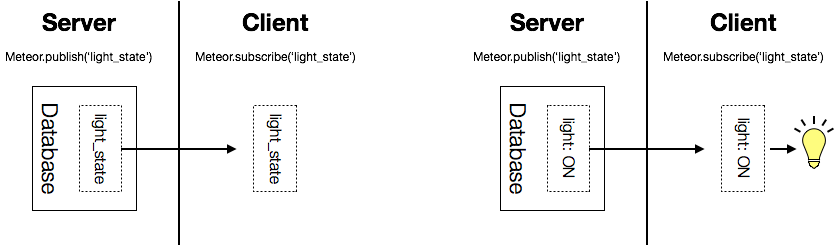

# Meteor 學習筆記 - (0) 簡介

Meteor 是一個全端(Full-stack)的應用程式框架，可以用單一的程式語言(Javascript)，快速建立高互動性的網路應用。它特別的是在資料的存取上。Meteor 前端在資料的獲取上是藉著 Reactive Programming 的方式，也就是前端向後端「訂閱(Subscribe)」特定的資料，前端再根據這些資料改變呈現的方式，如下圖。

而在資料的寫入上，Meteor 藉著前端的 minimongo 函式庫，產生 cache 的效果，因此可以快速反應資料的變化。以下是[官網](https://guide.meteor.com)的簡介

> Meteor is a full-stack JavaScript platform for developing modern web and mobile applications. Meteor includes a key set of technologies for building connected-client reactive applications, a build tool, and a curated set of packages from the Node.js and general JavaScript community.

就像上述簡介中提到的，Meteor 還包含自己的建制工具(build tool)和套件管理系統(package manager)，也有自己的套件平台([atmosphere](https://atmospherejs.com))和伺服器管理服務(Hosting)([Galaxy](https://www.meteor.com/pricing))。Meteor 最早的版本在 2012 年推出，一開始的前端框架是用自己的 Blaze templating engine，不過後來也有支援目前主流的 React, Angular.js, Vue.js 等等。後端使用 Node.js 配合 mongo db，也可以利用開發者提供的 [Meteor-Files](https://github.com/VeliovGroup/Meteor-Files) 來進行檔案管理，不過在 mongo 的 query 上為了達到 reactive programming 的結果，必須使用內建的指令，和 mongo 原生的 query 稍微有點不同，在資料的 aggregate 上需要用社群開發者提供的工具。

稍微整理一下幾個我自己在使用上認為的好處，因為前端我只用過 React，所以會以 React 的角度出發：
1. 前後端使用同一種語言，因此可以使用相同的函數庫，也更容易作版本的控制。當然缺點就是原本前後端的分工變得困難
2. Publish-subscribe, mongo-minimongo 的資料存取方式，讓開發者只需要專注在資料如何呈現和資料寫入時的邏輯就好。缺點是資料傳輸的效率不容易掌控
3. mongo-minimongo 的對應，讓前後端可說是一定會使用同一種 data model，少掉需要資料轉換的問題。
4. minimongo 可以很完美的和 react 搭配，可以想像成把 redux 的 store 直接跟 server 還有其他使用者同步，這部份會留在之後討論。

總結來說，不同的框架，有它的適用範圍，meteor 很適合的用在需要多人即時的互動上，由於資料的傳輸是利用 websocket 和自己的 DDP 協定，因此如果是用在大型高流量的網站，就會出現效能上面的問題。另一方面，由於簡化很多傳輸上面的問題，因此也很適合當作 web 開發新手的練習環境，可以藉此學習前後端開發和架構設計。(Udemy 上的 [Meteor-React](https://www.udemy.com/meteor-react/learn/v4/overview) 課程就是藉著 meteor 很完整的從一個 web app 如何建立開始講起，自己從這門課中也獲益良多)

以下是接下來預計的內容(暫定)
1. Meteor 環境安裝和資料夾結構(meteor, react, scss)
2. Meteor DataFlow，以 Todo app 為例
3. Minimongo, Session vs Redux
4. Mongo 指令和 Schema-validation，包含 [meteor-publish-composite](https://github.com/englue/meteor-publish-composite) 和 [simpl-schema](https://github.com/aldeed/meteor-simple-schema) 兩個 library
5. Test in Meteor([Mocha](https://github.com/mochajs/mocha))
6. Meteor packages:
 - [Accounts](https://medium.com/r/?url=https%3A%2F%2Fdocs.meteor.com%2Fapi%2Faccounts.html): 管理使用者註冊、登入、登出
 - [Meteor-Files](https://github.com/VeliovGroup/Meteor-Files): 和 GridFs 或第三方的文件儲存空間結合，管理文件
 - [meteor-user-state](https://medium.com/r/?url=https%3A%2F%2Fgithub.com%2Fmizzao%2Fmeteor-user-status): 取得使用者登入、登出的事件
 - [streamy](https://medium.com/r/?url=https%3A%2F%2Fatmospherejs.com%2Fyuukan%2Fstreamy): 利用 Meteor 本身建立的 socket 傳送資料。